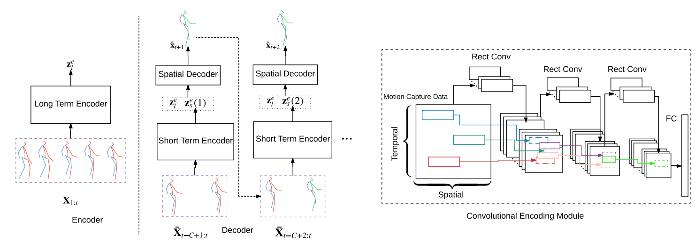

# Convolutional-Sequence-to-Sequence-Model-for-Human-Dynamics



**About**

This is the source code for the paper 

Chen Li, Zhen Zhang, Wee Sun Lee, Gim Hee Lee. Convolutional Sequence to Sequence Model for Human Dynamics. In CVPR2018.

The paper proposes a Convolotinal sequence-to-sequence model for human motion prediction. For more details, please refer to our paper on arxiv: http://arxiv.org/abs/1805.00655.pdf.

Bibtex:
```
@InProceedings{Li_2018_CVPR,
author = {Li, Chen and Zhang, Zhen and Sun Lee, Wee and Hee Lee, Gim},
title = {Convolutional Sequence to Sequence Model for Human Dynamics},
booktitle = {The IEEE Conference on Computer Vision and Pattern Recognition (CVPR)},
month = {June},
year = {2018}
} 
```

**Dependencies**
1. h5py--to save samples
2. Tensorflow 1.2 or later

**Train**

Get this code:
```
git clone https://github.com/chaneyddtt/Convolutional-Sequence-to-Sequence-Model-for-Human-Dynamics.git
```
Run:
```
python src/AC_main.py 
```
You can also change the arguments during training, for example,you can change the training dataset to CMU dataset by run:
```
python src/AC_main.py --dataset cmu
```
You can also change other arguments in the AC_main.py in a similar way.

 **Visualize**
 
To visualize the predicted results, run:
```
python src/forward_kinematics.py (you have to specify the sample file in the code)
```
or run:
```
python src/forward_kinematics_cmu.py (for the CMU dataset)
```

**Acknowledgments**

The pre-processed human3.6 dataset and some of our evaludation code was ported or adapted from SRNN [@asheshjain399](https://github.com/asheshjain399/RNNexp) and RRNN by [@una-dinosauria](https://github.com/una-dinosauria/human-motion-prediction).
